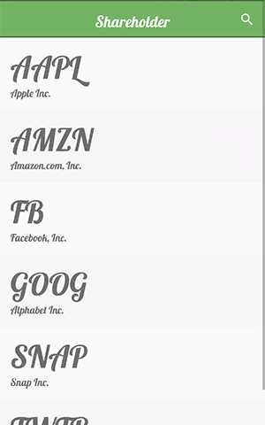

# animated-line-graph-view

An animated Line Graph view for Android.

## Demo

This is an example of `AnimatedLineGraphView` being used as a background for a stocks app.



There is a demo project in the [demo](./demo) directory, with sample code in [MainActivity.java](./demo/app/src/main/java/co/blankkeys/algvdemo/MainActivity.java) and [activity_main.xml](./demo/app/src/main/res/layout/activity_main.xml).

## Installation

In your project `build.gradle` add the [jitpack.io](https://jitpack.io/) repository:

```
allprojects {
    repositories {
        ...
        maven { url 'https://jitpack.io' }
    }
}
```
And in your application `build.gradle` add the `animated-line-graph-view` dependency:

```
dependencies {
    ...
    compile 'com.github.KyleBanks:animated-line-graph-view:v1.0.0'
}
```

## Setup

You can add an `AnimatedLineGraphView` via XML or in Java:

```xml
<co.blankkeys.animatedlinegraphview.AnimatedLineGraphView
    android:id="@+id/graph"
    android:layout_width="match_parent"
    android:layout_height="200dp"/>                   
```

```java
AnimatedLineGraphView graph = (AnimatedLineGraphView) findViewById(R.id.graph)
// OR
AnimatedLineGraphView graph = new AnimatedLineGraphView(context);
```

Once you have your `AnimatedLineGraphView` reference, you need to pass it some data. The `AnimatedLineGraphView` assumes your data is evenly distributed on the X-axis, and accepts the Y-axis data as a `float[]` like so:

```java
float[] data = new float[]{1.0f, 4.0f, 2.5f, 6.4f, 2.5f}; // for example
graph.setData(data);
```

Each time you call `setData`, the `AnimatedLineGraphView` will reset itself and animate from the beginning.

## Customization

`AnimatedLineGraphView` supports the following customization options:

- **Duration** *(default: 900)*: The animation duration in milliseconds.
- **Line Thickness** *(default: 15)*: The thickness of the line.
- **Line Color** *(default: android.R.color.black)*: The color of the line.
- **Circle Radius** *(default: 20)*: The radius of the circle the leads the animation.
- **Circle Color** *(default: android.R.color.black)*: The color of the circle that leads the animation.
- **Padding Percentage** *(default: 0.02)*: The vertical graph padding, as a percentage of the total height (0.02 = 2%)

Each option can be customized through XML or Java:

```xml
<co.blankkeys.animatedlinegraphview.AnimatedLineGraphView
    android:id="@+id/graph"
    android:layout_width="match_parent"
    android:layout_height="200dp"
    app:duration="300"
    app:lineThickness="20"   
    app:lineColor="@color/colorPrimary"
    app:circleRadius="40"
    app:circleColor="@color/colorAccent"
    app:paddingPercent=".05"/>    
```

```java
AnimatedLineGraphView graph = ...;
graph.setAnimationDuration(300);
graph.setLineThickness(20);
graph.setLineColor(R.color.colorPrimary);
graph.setCircleRadius(40);
graph.setCircleColor(R.color.colorAccent);
graph.setPaddingPercent(0.05f);
```

## Authors

- [KyleBanks](https://kylewbanks.com/blog)

## License

```
MIT License

Copyright (c) 2017 Kyle Banks

Permission is hereby granted, free of charge, to any person obtaining a copy
of this software and associated documentation files (the "Software"), to deal
in the Software without restriction, including without limitation the rights
to use, copy, modify, merge, publish, distribute, sublicense, and/or sell
copies of the Software, and to permit persons to whom the Software is
furnished to do so, subject to the following conditions:

The above copyright notice and this permission notice shall be included in all
copies or substantial portions of the Software.

THE SOFTWARE IS PROVIDED "AS IS", WITHOUT WARRANTY OF ANY KIND, EXPRESS OR
IMPLIED, INCLUDING BUT NOT LIMITED TO THE WARRANTIES OF MERCHANTABILITY,
FITNESS FOR A PARTICULAR PURPOSE AND NONINFRINGEMENT. IN NO EVENT SHALL THE
AUTHORS OR COPYRIGHT HOLDERS BE LIABLE FOR ANY CLAIM, DAMAGES OR OTHER
LIABILITY, WHETHER IN AN ACTION OF CONTRACT, TORT OR OTHERWISE, ARISING FROM,
OUT OF OR IN CONNECTION WITH THE SOFTWARE OR THE USE OR OTHER DEALINGS IN THE
SOFTWARE.
```
